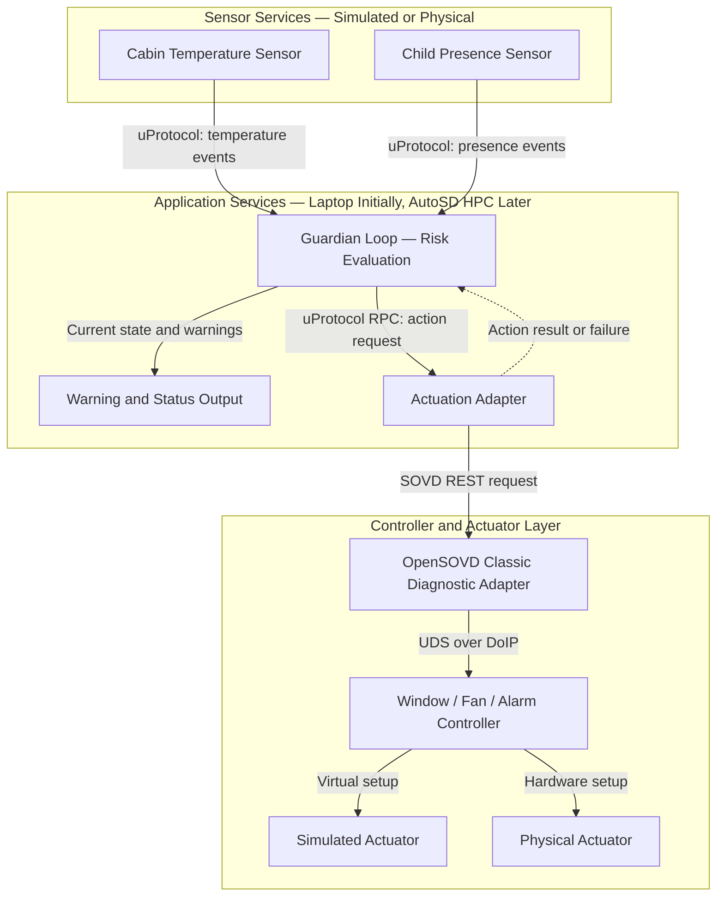

# Six_In_Sync
Guardian Loop: A portable child presence detection and cabin safety prototype bridging simulation and real vehicles with uProtocol, openDuT, OpenBSW, and AutoSD.

# Preview
No Prework or Knowlege was brought. Everything was done from scratch.

## Guardian Loop — System Overview

Guardian Loop is a proposed child-safety feature for a parked vehicle.
It monitors child presence and cabin temperature, evaluates potential
risk, and requests a warning or protective action.

The main goal is to develop the feature using simulated components,
then connect it to real sensors and controllers without rewriting
the Guardian decision logic.

## How the System Works

1. **Measure cabin temperature**
   A temperature sensor publishes readings so that Guardian can
   monitor the temperature and detect increases.

2. **Detect child presence**
   A separate sensor reports whether a child is present:
   `true` or `false`.

3. **Evaluate the situation**
   Guardian receives both inputs and determines whether to continue
   monitoring, issue a warning, or request an intervention.

4. **Request an action**
   When intervention is required, Guardian sends a high-level request,
   such as opening a window, turning on a fan, or activating an alarm.

5. **Execute the action**
   An adapter translates the request for the controller.
   The controller operates the simulated or physical actuator and
   reports the result.

## Proposed System Architecture

The simulated and physical actuator branches represent alternative
test configurations. The action result returns through the controller,
CDA, and adapter to Guardian.

**openDuT manages the test connections and topology.** It supports
switching between virtual and physical test configurations; it is
not an additional step in the action-request chain.

## Role of Each Technology

| Technology | Role in the proposed system |
|---|---|
| **uProtocol** | Carries sensor events and action requests between services through consistent interfaces. |
| **openDuT** | Manages connections between the simulated and physical components in the test environment. |
| **AutoSD** | Provides the Linux-based environment for running Guardian on the vehicle’s central computer. |
| **OpenBSW** | Provides embedded software building blocks for the controller implementation. |
| **OpenSOVD CDA** | Bridges SOVD requests to the traditional diagnostic communication used by the controller. |

## Core Design Rule

**Keep decision-making separate from hardware control.**

Guardian decides **what should happen**. Adapters and controllers
handle **how it happens**.

For example, Guardian requests “open the window to 25%” without
needing to know whether the target is a simulated window or a
physical window motor.

Hardware-specific details belong in adapters, controllers, and
configuration—not in Guardian’s decision logic.

## Development Plan

1. Simulate child presence and cabin temperature.
2. Connect the sensor services to Guardian using uProtocol.
3. Display Guardian’s monitoring, warning, and intervention states.
4. Connect one simulated actuator and demonstrate an action.
5. Deploy Guardian to the AutoSD environment.
6. Replace simulated components with physical components.
7. Use openDuT to demonstrate a change in test configuration.

## Success Criteria

The system should demonstrate that:

- Both sensor inputs reach Guardian.
- Guardian evaluates the inputs and produces an appropriate state.
- An action request reaches a simulated or physical controller.
- Action success or failure is reported.
- A simulated endpoint can be replaced by a physical endpoint
  without changing Guardian’s decision logic.

Configuration, deployment, and hardware adapters may change.
The Guardian decision logic and service interfaces should remain
unchanged.

> This is a hackathon prototype. Child presence is initially
> simulated, and demonstration thresholds are not certified
> vehicle-safety thresholds.

## Copyright (c) 2026 Real H. Uman 1

- This program and the accompanying materials are made available under the terms of the Eclipse Public License 2.0 which accompanies this
distribution, and is available at https://www.eclipse.org/legal/epl-2.0/

# AI Disclosure: 
- Our solution partly used AI. The AI-generated 3
portions are made available under CC0-1.0 and not subject to the
project's licence. The human contributor has reviewed and verified
that the code is correct.

- SPDX-License-Identifier: EPL-2.0 and CC0-1.0 4
- **Topic:** System Architecture & Rust Code
- **Assisted-by:** ChatGPT (GPT-6 Astra)
  

